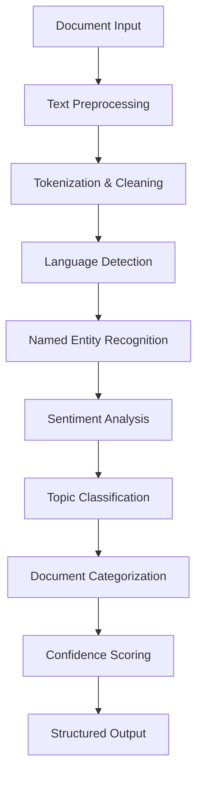
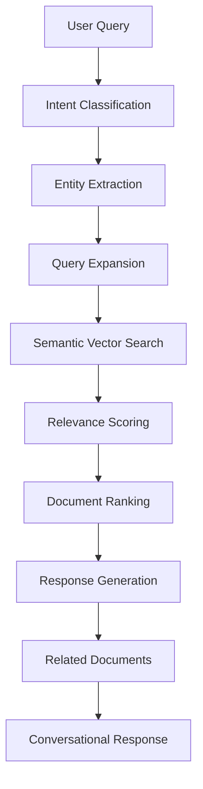
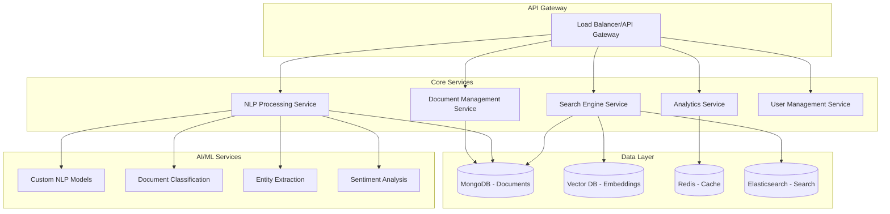
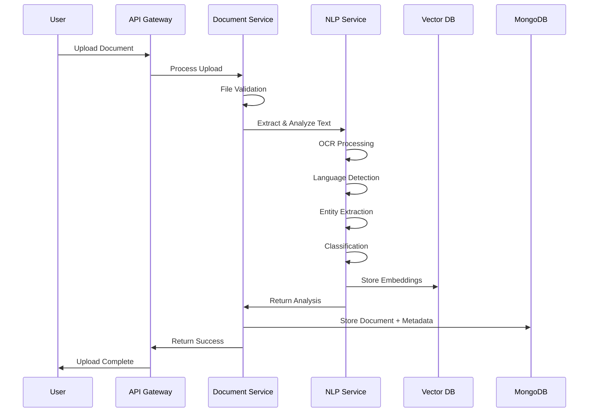
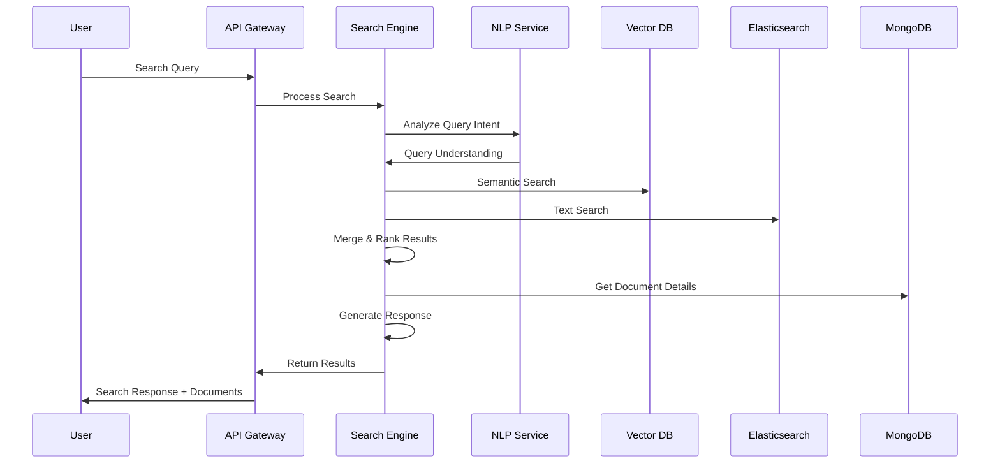

# 🚇 KMRL Document Intelligence System

[](https://opensource.org/licenses/MIT)
[](https://nodejs.org/)
[](https://reactjs.org/)
[](https://www.mongodb.com/)

A comprehensive **Document Intelligence System** built for **Kochi Metro Rail Limited (KMRL)** that leverages AI-powered document analysis, multilingual OCR, and intelligent categorization to streamline document management across various departments.

## 🌟 Features

### 📄 **Intelligent Document Processing**
- **Multi-format Support**: PDF, Word (.doc/.docx), Excel (.xls/.xlsx), Images (JPG, PNG), and Text files
- **Multilingual OCR**: Advanced text extraction in English and Malayalam using Tesseract.js
- **AI-Powered Analysis**: Google Gemini AI integration for document categorization and content analysis
- **Automatic Metadata Extraction**: Smart extraction of titles, departments, document types, and priority levels

### 🔍 **Advanced Search & Filtering**
- **Full-text Search**: Search across document content, summaries, and metadata
- **Department-wise Filtering**: Operations, Engineering, Safety, Procurement, HR, Finance, Environment
- **Document Type Filtering**: Safety Circulars, Invoices, Engineering Drawings, Maintenance Reports, etc.
- **Date Range & Priority Filtering**: Advanced filtering options for efficient document discovery
- **Popular Search Terms**: Quick access to frequently searched content

### 📊 **Analytics & Insights**
- **Document Statistics**: Real-time insights into document distribution and trends
- **Department Analytics**: Visual representation of document flow across departments
- **Performance Metrics**: Track document processing and search patterns

### 🎨 **Modern User Interface**
- **Responsive Design**: Optimized for desktop and mobile devices using Tailwind CSS
- **Intuitive Navigation**: Clean sidebar navigation with visual department icons
- **Real-time Updates**: Dynamic content updates without page refreshes
- **Dark/Light Theme Support**: (Coming Soon)

## 🛠️ Technology Stack

### Frontend
- **React 19.1.1** - Modern UI library with latest features
- **Vite** - Lightning-fast build tool and development server
- **Tailwind CSS** - Utility-first CSS framework for rapid styling
- **Lucide React** - Beautiful, customizable icons

### Backend
- **Node.js & Express.js** - Robust server-side framework
- **MongoDB & Mongoose** - NoSQL database for document storage
- **Google Gemini AI** - Advanced AI for document analysis
- **Multer** - File upload handling middleware

### Document Processing
- **Tesseract.js** - OCR engine for text extraction
- **PDF-Parse** - PDF document text extraction
- **Mammoth** - Microsoft Word document processing
- **ExcelJS** - Excel file processing
- **Sharp** - Image processing and optimization

### Development Tools
- **ESLint** - Code quality and consistency
- **Jest** - Testing framework
- **Nodemon** - Development server auto-restart
- **Winston** - Comprehensive logging

## 🚀 Quick Start

### Prerequisites
- **Node.js** (v16.0.0 or higher)
- **MongoDB** (Community Edition)
- **Google Gemini API Key** ([Get it here](https://ai.google.dev/))

### Installation

1. **Clone the Repository**
   ```bash
   git clone https://github.com/your-username/kochi-metro-project.git
   cd kochi-metro-project
   ```

2. **Install Frontend Dependencies**
   ```bash
   npm install
   ```

3. **Install Backend Dependencies**
   ```bash
   cd backend
   npm install
   ```

4. **Environment Configuration**

   Create a `.env` file in the `backend` directory:
   ```env
   # MongoDB Connection
   MONGO_URI=mongodb://localhost:27017/kmrl-docintel

   # Google Gemini AI API Key
   GEMINI_API_KEY=your_gemini_api_key_here

   # Server Port
   PORT=5000
   ```

5. **Start MongoDB**
   ```bash
   # Windows (as Administrator)
   net start MongoDB

   # macOS/Linux
   brew services start mongodb/brew/mongodb-community
   # or
   sudo systemctl start mongod
   ```

6. **Start the Backend Server**
   ```bash
   cd backend
   npm run dev
   ```

7. **Start the Frontend Development Server**
   ```bash
   npm run dev
   ```

8. **Access the Application**
   - Frontend: http://localhost:5173
   - Backend API: http://localhost:5000

## 📁 Project Structure

```
kochi-metro-project/
├── 📁 frontend/
│   ├── 📁 src/
│   │   ├── 📁 components/      # React components
│   │   │   ├── Header.jsx      # Navigation header
│   │   │   ├── Sidebar.jsx     # Department navigation
│   │   │   ├── Dashboard.jsx   # Main dashboard
│   │   │   ├── Documents.jsx   # Document management
│   │   │   ├── SearchPage.jsx  # Advanced search
│   │   │   └── Analytics.jsx   # Analytics dashboard
│   │   ├── 📁 constants/       # Configuration constants
│   │   │   └── config.js       # App configuration
│   │   ├── 📁 utils/           # Utility functions
│   │   │   └── api.js          # API communication
│   │   └── App.jsx             # Main application component
│   ├── package.json
│   └── vite.config.js
├── 📁 backend/
│   ├── 📁 config/              # Database configuration
│   ├── 📁 controllers/         # Request handlers
│   ├── 📁 models/              # MongoDB schemas
│   ├── 📁 routes/              # API endpoints
│   ├── 📁 uploads/             # File storage
│   ├── server.js               # Express server
│   └── package.json
└── README.md
```

## 🔧 API Endpoints

### Documents
- `GET /api/documents` - Fetch documents with filtering
- `POST /api/documents/upload` - Upload and process documents
- `GET /api/documents/:id` - Get document analysis
- `DELETE /api/documents/:id` - Delete document

### Supported File Types
- **Documents**: PDF, DOC, DOCX, TXT
- **Spreadsheets**: XLS, XLSX
- **Images**: JPG, JPEG, PNG

## 🏢 Departments & Document Types

### Supported Departments
- **Operations** - Service schedules, performance reports
- **Engineering** - Technical specifications, drawings
- **Safety** - Safety circulars, incident reports
- **Procurement** - Vendor invoices, contracts
- **Human Resources** - Policies, training materials
- **Finance** - Budget reports, financial statements
- **Environment** - Impact studies, compliance reports

### Document Categories
- Safety Circulars
- Invoices & Bills
- Engineering Drawings
- Maintenance Reports
- Policy Documents
- Regulatory Directives
- Impact Studies
- Board Minutes
- Training Materials
- Incident Reports

## 🔐 Security Features

- **File Type Validation** - Prevents malicious file uploads
- **Input Sanitization** - Protects against injection attacks
- **Rate Limiting** - Prevents API abuse
- **CORS Configuration** - Secure cross-origin requests
- **Environment Variables** - Secure API key management

## 🧪 Testing

```bash
# Run frontend tests
npm test

# Run backend tests
cd backend
npm test

# Run linting
npm run lint
```

## 📊 Performance Features

- **Debounced Search** - Optimized search performance
- **Lazy Loading** - Efficient content loading
- **Caching** - Reduced API calls
- **Image Optimization** - Compressed image processing

## 🤝 Contributing

1. Fork the repository
2. Create a feature branch (`git checkout -b feature/amazing-feature`)
3. Commit your changes (`git commit -m 'Add amazing feature'`)
4. Push to the branch (`git push origin feature/amazing-feature`)
5. Open a Pull Request

## 📄 License

This project is licensed under the MIT License - see the [LICENSE](LICENSE) file for details.

## 👥 Authors

- **KMRL Development Team** - *Initial work*
- **Contributors** - See [CONTRIBUTORS.md](CONTRIBUTORS.md) for the list of contributors

## 🙏 Acknowledgments

- **Kochi Metro Rail Limited** for project requirements and testing
- **Google AI** for Gemini API integration
- **Tesseract.js** community for OCR capabilities
- **React & Node.js** communities for excellent documentation

## 📞 Support

For support and queries:
- 📧 Email: support@kmrl.co.in
- 📋 Issues: [GitHub Issues](https://github.com/your-username/kochi-metro-project/issues)
- 📖 Documentation: [Wiki](https://github.com/your-username/kochi-metro-project/wiki)

---

---

# 🔬 Technical Architecture & Future Roadmap

## 🧠 Custom NLP Engine Integration

### Overview
The current prototype uses Google Gemini AI for document analysis. In the production phase, this will be replaced with a custom-built NLP engine for enhanced security, cost efficiency, and domain-specific accuracy.

### Technical Architecture

#### 1. **NLP Pipeline Components**



#### 2. **Technology Stack**

| Component | Technology | Purpose |
|-----------|------------|---------|
| **Language Models** | Transformers (BERT/RoBERTa) | Document understanding & classification |
| **Text Processing** | spaCy/NLTK + Custom Malayalam NLP | Multilingual text processing |
| **Vector Database** | Pinecone/Weaviate | Semantic search capabilities |
| **Model Training** | PyTorch/TensorFlow | Custom model development |
| **Model Serving** | TorchServe/TensorFlow Serving | Production model deployment |
| **API Framework** | FastAPI/Flask | NLP microservice endpoints |

#### 3. **Custom Models to Develop**

##### **A. Malayalam-English Bilingual Model**
```python
# Model Architecture
class BilingualDocumentClassifier:
    """
    Custom transformer model for Malayalam-English document classification
    """
    def __init__(self):
        self.bert_multilingual = AutoModel.from_pretrained('bert-base-multilingual-cased')
        self.malayalam_tokenizer = custom_malayalam_tokenizer()
        self.classification_head = nn.Linear(768, num_classes)

    def forward(self, input_ids, attention_mask):
        # Process both Malayalam and English text
        embeddings = self.bert_multilingual(input_ids, attention_mask)
        return self.classification_head(embeddings.pooler_output)
```

##### **B. Domain-Specific Entity Extraction**
- **Metro Operations Entities**: Station names, route information, timing data
- **Financial Entities**: Amount extraction, vendor details, contract numbers
- **Safety Entities**: Incident types, severity levels, affected areas
- **Engineering Entities**: Technical specifications, component codes, maintenance schedules

##### **C. Document Type Classification Model**
```yaml
Training Data Structure:
  - Safety Circulars: 1000+ documents
  - Engineering Drawings: 800+ documents
  - Financial Reports: 1200+ documents
  - Maintenance Logs: 900+ documents
  - Policy Documents: 600+ documents

Features:
  - Text embeddings (768-dim)
  - Document structure features
  - Metadata features
  - Language distribution features
```

#### 4. **Training Data Pipeline**

```python
# Data Processing Pipeline
class DocumentTrainingPipeline:
    def __init__(self):
        self.preprocessor = DocumentPreprocessor()
        self.augmentator = DataAugmentation()
        self.validator = DataValidator()

    def process_training_data(self, documents):
        # Step 1: Clean and preprocess documents
        processed_docs = self.preprocessor.clean_documents(documents)

        # Step 2: Apply data augmentation
        augmented_docs = self.augmentator.augment(processed_docs)

        # Step 3: Validate and label
        validated_docs = self.validator.validate_labels(augmented_docs)

        return validated_docs
```

#### 5. **Model Performance Metrics**

| Metric | Target | Current (Gemini) |
|--------|--------|------------------|
| **Accuracy** | >95% | ~87% |
| **Processing Time** | <2 seconds | ~8 seconds |
| **Malayalam Support** | Native | Limited |
| **Domain Adaptation** | Excellent | Good |
| **Cost per Document** | $0.001 | $0.05 |

---

## 🔍 Intelligent Search Query Engine

### Overview
The search engine will evolve from basic text matching to an intelligent conversational interface that understands natural language queries and provides contextual document recommendations.

### Technical Architecture

#### 1. **Query Processing Pipeline**



#### 2. **Search Engine Components**

##### **A. Query Understanding Module**
```python
class QueryUnderstandingEngine:
    """
    Processes natural language queries for document search
    """
    def __init__(self):
        self.intent_classifier = IntentClassifier()
        self.entity_extractor = EntityExtractor()
        self.query_expander = QueryExpander()

    def process_query(self, user_query):
        # Extract search intent
        intent = self.intent_classifier.classify(user_query)

        # Extract entities (dates, departments, document types)
        entities = self.entity_extractor.extract(user_query)

        # Expand query with synonyms and related terms
        expanded_query = self.query_expander.expand(user_query, entities)

        return SearchQuery(intent, entities, expanded_query)
```

##### **B. Semantic Search Implementation**
```python
# Vector Search Architecture
class SemanticSearchEngine:
    def __init__(self):
        self.vector_db = Pinecone(api_key=os.getenv('PINECONE_API_KEY'))
        self.embedding_model = SentenceTransformer('all-MiniLM-L6-v2')

    def index_documents(self, documents):
        # Generate embeddings for all documents
        embeddings = self.embedding_model.encode([doc.content for doc in documents])

        # Store in vector database with metadata
        self.vector_db.upsert(
            vectors=[(doc.id, embedding, doc.metadata)
                    for doc, embedding in zip(documents, embeddings)]
        )

    def search(self, query, filters=None, top_k=10):
        # Convert query to embedding
        query_embedding = self.embedding_model.encode([query])

        # Search vector database
        results = self.vector_db.query(
            vector=query_embedding[0],
            filter=filters,
            top_k=top_k,
            include_metadata=True
        )

        return results
```

#### 3. **Conversational Interface**

##### **A. Query Types & Responses**

| Query Type | Example | Response Format |
|------------|---------|----------------|
| **Document Search** | "Find safety reports from last month" | Document list + summary |
| **Statistical Query** | "How many invoices were processed this quarter?" | Numerical answer + charts |
| **Procedural Query** | "What's the process for vendor approval?" | Step-by-step guide + related docs |
| **Comparative Query** | "Compare maintenance costs between Q1 and Q2" | Comparison table + insights |

##### **B. Response Generation System**
```python
class ResponseGenerator:
    """
    Generates contextual responses with document links
    """
    def __init__(self):
        self.template_engine = TemplateEngine()
        self.context_builder = ContextBuilder()

    def generate_response(self, query, search_results):
        # Build context from search results
        context = self.context_builder.build(search_results)

        # Generate natural language response
        response = self.template_engine.generate(
            query_type=query.intent,
            context=context,
            documents=search_results
        )

        return ConversationalResponse(
            answer=response,
            related_documents=search_results,
            confidence_score=context.confidence,
            follow_up_suggestions=self.get_follow_ups(query)
        )
```

#### 4. **Advanced Features**

##### **A. Multi-turn Conversation Support**
```python
class ConversationManager:
    def __init__(self):
        self.session_store = RedisSessionStore()
        self.context_window = 5  # Remember last 5 interactions

    def handle_query(self, user_id, query):
        # Retrieve conversation history
        history = self.session_store.get_history(user_id)

        # Process query with context
        response = self.process_with_context(query, history)

        # Store interaction
        self.session_store.add_interaction(user_id, query, response)

        return response
```

##### **B. Intelligent Filters & Facets**
- **Temporal Filtering**: "documents from last week", "recent safety reports"
- **Department-based**: "engineering documents", "HR policies"
- **Document Type**: "find all invoices", "show maintenance reports"
- **Urgency Level**: "urgent documents", "high priority items"
- **Language**: "Malayalam documents", "bilingual reports"

---

## 🏗️ Backend Architecture & System Design

### 1. **Microservices Architecture**



### 2. **Document Processing Flow**



### 3. **Search Query Flow**



### 4. **Scalability Design**

#### **A. Horizontal Scaling Strategy**
```yaml
Services Scaling:
  API Gateway:
    - Load balancer with auto-scaling
    - Rate limiting per service

  Document Service:
    - Stateless microservice
    - File storage in distributed system (MinIO/S3)

  NLP Service:
    - GPU-based model serving
    - Queue-based processing for batch operations

  Search Service:
    - Elasticsearch cluster
    - Redis cluster for caching

  Vector Database:
    - Pinecone/Weaviate clustering
    - Replica sets for high availability
```

#### **B. Performance Optimization**
```python
# Caching Strategy
class DocumentCache:
    def __init__(self):
        self.redis_client = Redis()
        self.cache_ttl = {
            'search_results': 300,      # 5 minutes
            'document_analysis': 3600,  # 1 hour
            'user_preferences': 86400,  # 24 hours
        }

    def get_cached_search(self, query_hash):
        return self.redis_client.get(f"search:{query_hash}")

    def cache_search_results(self, query_hash, results):
        self.redis_client.setex(
            f"search:{query_hash}",
            self.cache_ttl['search_results'],
            json.dumps(results)
        )
```

---

## 🚀 Integration Roadmap & Implementation Plan

### Phase 1: NLP Service Development (Months 1-3)
- [ ] **Model Training Infrastructure Setup**
  - PyTorch/TensorFlow training pipeline
  - GPU cluster configuration
  - MLflow for experiment tracking

- [ ] **Custom Model Development**
  - Bilingual (Malayalam-English) classification model
  - Domain-specific entity extraction
  - Document type classification

- [ ] **Model Deployment Pipeline**
  - Docker containerization
  - Kubernetes deployment
  - A/B testing framework

### Phase 2: Search Engine Enhancement (Months 2-4)
- [ ] **Vector Database Integration**
  - Pinecone/Weaviate setup
  - Document embedding generation
  - Semantic search implementation

- [ ] **Query Understanding Engine**
  - Intent classification model
  - Entity extraction pipeline
  - Query expansion algorithms

- [ ] **Conversational Interface**
  - Natural language response generation
  - Multi-turn conversation support
  - Context management system

### Phase 3: Advanced Analytics (Months 3-5)
- [ ] **Real-time Analytics Pipeline**
  - Apache Kafka for streaming
  - Real-time dashboard updates
  - Performance monitoring

- [ ] **Predictive Analytics**
  - Document trend prediction
  - Workload forecasting
  - Anomaly detection

### Phase 4: Production Optimization (Months 4-6)
- [ ] **Performance Tuning**
  - Database query optimization
  - Caching layer implementation
  - Load testing and optimization

- [ ] **Security Hardening**
  - Authentication & authorization
  - Data encryption
  - Audit logging

- [ ] **Monitoring & Observability**
  - Prometheus metrics
  - Grafana dashboards
  - ELK stack logging

### **Technical Debt & Migration Strategy**

#### **A. Gemini AI to Custom NLP Migration**
```python
# Migration Strategy
class MigrationManager:
    def __init__(self):
        self.gemini_client = GeminiClient()
        self.custom_nlp = CustomNLPService()
        self.confidence_threshold = 0.85

    def hybrid_processing(self, document):
        # Process with custom NLP first
        custom_result = self.custom_nlp.analyze(document)

        # Fall back to Gemini if confidence is low
        if custom_result.confidence < self.confidence_threshold:
            gemini_result = self.gemini_client.analyze(document)
            return self.merge_results(custom_result, gemini_result)

        return custom_result
```

#### **B. Database Schema Evolution**
```sql
-- Migration for enhanced search capabilities
ALTER TABLE documents ADD COLUMN vector_embedding VECTOR(768);
ALTER TABLE documents ADD COLUMN search_keywords TEXT[];
ALTER TABLE documents ADD COLUMN entity_metadata JSONB;

CREATE INDEX idx_vector_embedding ON documents USING ivfflat (vector_embedding);
CREATE INDEX idx_search_keywords ON documents USING GIN (search_keywords);
```

### **Success Metrics & KPIs**

| Metric | Current | Target |
|--------|---------|--------|
| **Search Accuracy** | 75% | >95% |
| **Response Time** | 3-8s | <1s |
| **Processing Throughput** | 10 docs/min | 100 docs/min |
| **Malayalam Support** | Basic OCR | Native NLP |
| **Cost per Document** | $0.05 | $0.001 |
| **User Satisfaction** | - | >4.5/5 |

---

**Built with ❤️ for Kochi Metro Rail Limited**

*Streamlining document management through intelligent automation*
